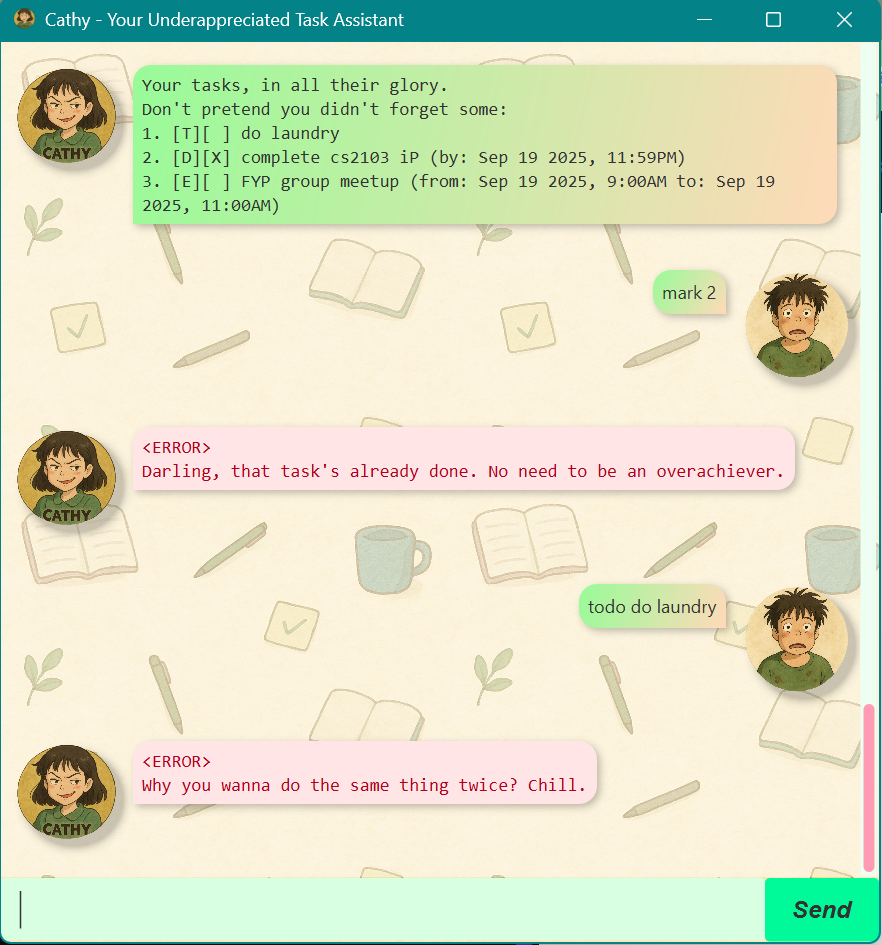

# Cathy User Guide

> *“If you can’t manage your life, at least let me laugh at your attempts.”* – Cathy

## Introduction

Your no-nonsense personal task assistant. Cathy is:
- **Text-based and efficient** – designed to keep distractions to a minimum
- **Relentlessly thorough** – she will remind you until the job is done
- **Fast and responsive** – optimized for quick command input and instant feedback
- **Witty and straightforward** – expect a dash of sarcasm when you make mistakes

Cathy is optimized for use via a **Command Line Interface (CLI)** and also provides a  
simple **Graphical User Interface (GUI)** for users who prefer a visual interaction experience.

## Product Interface


**Cathy** gives you a **minimalist chat-style interface** that
feels personal, fast, and a little judgmental — just the 
**motivation** you never knew you needed.

## Contents

1. [Quick Start](#quick-start)
2. [Overview of Features](#overview-of-features)
2. [Adding ToDos](#adding-todos)
3. [Adding Deadlines](#adding-deadlines)
4. [Adding Events](#adding-events)
5. [Listing Tasks](#listing-tasks)
6. [Marking Tasks as Done](#marking-tasks-as-done)
7. [Unmarking Tasks](#unmarking-tasks)
8. [Deleting Tasks](#deleting-tasks)
9. [Finding Tasks](#finding-tasks)
10. [Viewing Schedule](#viewing-schedule)
11. [Viewing Tasks on a Specific Date](#viewing-tasks-on-a-specific-date)
11. [Exiting the Program](#exiting-the-program)

## Quick Start

1. Ensure you have Java 17 or above installed on your computer.
2. Download the latest Cathy.jar file from the [Releases page](https://github.com/Gracesong146/ip/releases).
2. Run it with
    ```
    java -jar cathy.jar
    ```
3. Add your precious tasks.
4. Watch Cathy roast you while you “try” to be productive.

## Overview of Features

| Command    | Arguments / Format | Description |
|------------|-------------------|-------------|
| `todo`     | `<description>` | Adds a ToDo task without date/time. |
| `deadline` | `<description> /by <yyyy-mm-dd> [hhmm]` | Adds a task with a due date (and optional time). |
| `event`    | `<description> /from <start-date> [hhmm] /to <end-date> [hhmm]` | Adds an event with a start and end time. |
| `list`     | – | Displays all current tasks. |
| `mark`     | `<task number>` | Marks the specified task as done. |
| `unmark`   | `<task number>` | Marks the specified task as **not** done. |
| `delete`   | `<task number>` | Removes the specified task from the list. |
| `find`     | `<keyword>` | Finds tasks that contain the keyword. |
| `sch`      | `<yyyy-mm-dd>` | Shows schedule for a specific date. |
| `on`       | `<yyyy-mm-dd>` | Shows tasks scheduled on a specific date. |
| `help`     | – | Displays all available commands. |
| `bye`      | – | Exits Cathy (after a short goodbye message). |


## Adding ToDos

Use the `todo` command followed by your task description.

**Example:**

```
todo Read book
```

**Output:**

```
Fine, I've added to the list:
  [T][ ] Read book
You've got 1 tasks now. Try not to lose track this time.
```

---

## Adding Deadlines

Use the `deadline` command followed by the description, `/by`, and a date (optionally with time in `HHMM` format).

**Example:**

```
deadline Submit report /by 2025-09-30
```

**Output:**

```
Fine, I've added to the list:
  [D][ ] Submit report (by: Sep 30 2025, 11:59PM)
You've got 2 tasks now. Try not to lose track this time.
```

---

## Adding Events

Use the `event` command followed by the description, `/from`, and `/to` with date (optionally with time in `HHMM` format).

**Example:**

```
event Team meeting /from 2025-10-01 14:00 /to 2025-10-01 16:00
```

**Output:**

```
Fine, I've added to the list:
  [E][ ] Team meeting (from: Oct 01 2025, 2:00PM to: Oct 01 2025, 4:00PM)
You've got 3 tasks now. Try not to lose track this time.
```

---

## Listing Tasks

Use the `list` command to view all tasks.

**Example:**

```
list
```

**Output:**

```
Your tasks, all in their glory.
Don't pretend you didn't forget some:
1. [T][ ] Read book
2. [D][ ] Submit report (by: Sep 30 2025, 11:59PM)
3. [E][ ] Team meeting (from: Oct 01 2025, 2:00PM to: Oct 01 2025, 4:00PM)
```

---

## Marking Tasks as Done

Use the `mark` command followed by the task number.

**Example:**

```
mark 1
```

**Output:**

```
Mark as done. Go ahead, feel proud for once:
  [T][X] Read book
```

---

## Unmarking Tasks

Use the `unmark` command followed by the task number.

**Example:**

```
unmark 1
```

**Output:**

```
Fine, it lives to torment you another day:
  [T][ ] Read book
```

---

## Deleting Tasks

Use the `delete` command followed by the task number.

**Example:**

```
delete 2
```

**Output:**

```
Noted. I've removed this task:
  [D][ ] Submit report (by: Sep 30 2025, 11:59PM)
One less thing for you to forget.
You've got 2 tasks now.
```

---

## Finding Tasks

Use the `find` command followed by a keyword.

**Example:**

```
find meeting
```

**Output:**

```
Here's what i painfully dug up for you:
1. [E][ ] Team meeting (from: Oct 01 2025, 2:00PM to: Oct 01 2025, 4:00PM)
```

---

## Viewing Schedule

Use the `sch` command followed by a date to see tasks scheduled for that day, in order.

**Example:**

```
sch 2025-10-01
```

**Output:**

```
Schedule for 2025-10-01:
   [E][ ] Team meeting (14:00-16:00)
```

## Viewing Tasks on a Specific Date

Use the `on` command followed by a date to search for tasks happening on that day.

**Example:**

```
on 2025-10-01
```

**Output:**

```
Tasks happening on 2025-10-01:
   [E][ ] Team meeting (from: Oct 01 2025, 2:00PM to: Oct 01 2025, 4:00PM)
```

---

## Exiting the Program

Use the `bye` command to close Cathy.

**Example:**

```
bye
```

**Output:**

```
Good Riddance.
```

---

## 🎯 Go and Conquer the Day!

Cathy will be here to keep you accountable — and mildly roasted — every step of the way.

> **Pro Tip:** Try not to make any errors... or Cathy will be relentless in roasting you.